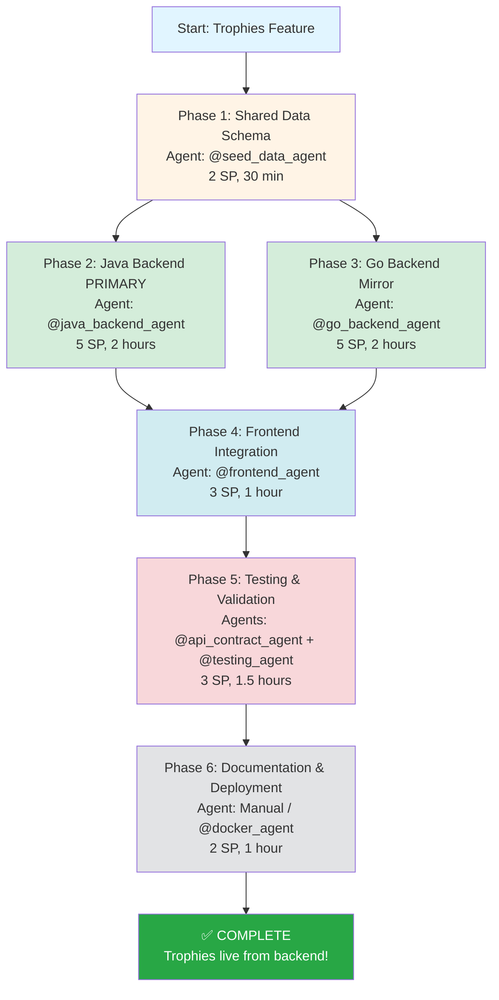

# Trophies Feature - Visual Workflow Diagram

## 🎯 Complete Implementation Flow



---

## 📋 Task Dependency Map

```
Task 1.1 (Seed Data)
    │
    ├─────────────────────────┐
    │                         │
    ▼                         ▼
Task 2.1 (Java Entity)    Task 3.1 (Go Model)
    │                         │
    ▼                         ▼
Task 2.2 (Java Service)   Task 3.2 (Go Service)
    │                         │
    ▼                         ▼
Task 2.3 (Java Seeding)   Task 3.3 (Go Seeding)
    │                         │
    ▼                         ▼
Task 2.4 (Java API)       Task 3.4 (Go API)
    │                         │
    └─────────┬───────────────┘
              │
              ▼
    Task 4.1 (Frontend Types & API)
              │
              ▼
    Task 4.2 (Frontend Component)
              │
              ├─────────────┬──────────────┐
              │             │              │
              ▼             ▼              ▼
    Task 5.1 (Contract) Task 5.2 (Tests) Task 5.3 (Integration)
              │             │              │
              └─────────────┴──────────────┘
                          │
                          ▼
              ┌───────────┴────────────┐
              │                        │
              ▼                        ▼
    Task 6.1 (Docs)          Task 6.2 (Docker)
              │                        │
              └───────────┬────────────┘
                          │
                          ▼
                    ✅ COMPLETE
```

---

## 🔄 Data Flow Architecture

```
┌─────────────────────────────────────────────────────────┐
│                                                         │
│  shared/trophies.json (Single Source of Truth)         │
│  ┌───────────────────────────────────────────────────┐ │
│  │ {                                                 │ │
│  │   "trophies": [                                   │ │
│  │     { "id": 1, "icon": "Crown", "name": ...}      │ │
│  │   ]                                               │ │
│  │ }                                                 │ │
│  └───────────────────────────────────────────────────┘ │
│                                                         │
└────────────┬───────────────────────────────┬───────────┘
             │                               │
             │ SEED ON STARTUP               │ SEED ON STARTUP
             │                               │
    ┌────────▼────────────┐         ┌───────▼────────────┐
    │                     │         │                    │
    │  JAVA BACKEND       │         │  GO BACKEND        │
    │  (PRIMARY)          │         │  (MIRROR)          │
    │                     │         │                    │
    │  ┌───────────────┐  │         │  ┌──────────────┐ │
    │  │ Trophy        │  │         │  │ Trophy       │ │
    │  │ Entity (JPA)  │  │         │  │ Model (GORM) │ │
    │  └───────┬───────┘  │         │  └──────┬───────┘ │
    │          │           │         │         │         │
    │  ┌───────▼───────┐  │         │  ┌──────▼───────┐ │
    │  │ TrophyRepo    │  │         │  │ TrophyRepo   │ │
    │  └───────┬───────┘  │         │  └──────┬───────┘ │
    │          │           │         │         │         │
    │  ┌───────▼───────┐  │         │  ┌──────▼───────┐ │
    │  │ TrophyService │  │         │  │ TrophyService│ │
    │  └───────┬───────┘  │         │  └──────┬───────┘ │
    │          │           │         │         │         │
    │  ┌───────▼───────┐  │         │  ┌──────▼───────┐ │
    │  │ Controller    │  │         │  │ Handler      │ │
    │  │ @GetMapping   │  │         │  │ GET /api/... │ │
    │  └───────┬───────┘  │         │  └──────┬───────┘ │
    │          │           │         │         │         │
    │  ┌───────▼───────┐  │         │  ┌──────▼───────┐ │
    │  │ H2/PostgreSQL │  │         │  │ SQLite       │ │
    │  └───────────────┘  │         │  └──────────────┘ │
    │                     │         │                    │
    │  :8080/api/trophies │         │  :8081/api/trophies│
    └──────────┬──────────┘         └────────┬───────────┘
               │                              │
               └──────────────┬───────────────┘
                              │
                              │ HTTP GET
                              │
                   ┌──────────▼───────────┐
                   │                      │
                   │  FRONTEND            │
                   │  (React + TypeScript)│
                   │                      │
                   │  ┌────────────────┐  │
                   │  │ TrophyResponse │  │
                   │  │ interface      │  │
                   │  └────────┬───────┘  │
                   │           │          │
                   │  ┌────────▼───────┐  │
                   │  │ getTrophies()  │  │
                   │  │ API service    │  │
                   │  └────────┬───────┘  │
                   │           │          │
                   │  ┌────────▼───────┐  │
                   │  │ Trophies.tsx   │  │
                   │  │ Component      │  │
                   │  │ (dynamic data) │  │
                   │  └────────┬───────┘  │
                   │           │          │
                   │  ┌────────▼───────┐  │
                   │  │ Icon Mapping   │  │
                   │  │ string → Icon  │  │
                   │  └────────────────┘  │
                   │                      │
                   │  :5173/trophies      │
                   └──────────────────────┘
```

---

## 🏗️ Layer Architecture

```
┌────────────────────────────────────────────────────┐
│                  PRESENTATION LAYER                │
│  ┌──────────────────────────────────────────────┐  │
│  │  Frontend (React + TypeScript)               │  │
│  │  • Trophies.tsx (component)                  │  │
│  │  • TrophyResponse (type)                     │  │
│  │  • getTrophies() (API service)               │  │
│  └──────────────────────────────────────────────┘  │
└────────────────────────────────────────────────────┘
                         │
                         │ REST API
                         ▼
┌────────────────────────────────────────────────────┐
│                   API LAYER                        │
│  ┌─────────────────────┐  ┌─────────────────────┐ │
│  │ Java Controller     │  │ Go Handler          │ │
│  │ • @GetMapping       │  │ • gin.Context       │ │
│  │ • /api/trophies     │  │ • GET handler       │ │
│  └─────────────────────┘  └─────────────────────┘ │
└────────────────────────────────────────────────────┘
                         │
                         │
                         ▼
┌────────────────────────────────────────────────────┐
│                 SERVICE LAYER                      │
│  ┌─────────────────────┐  ┌─────────────────────┐ │
│  │ TrophyService       │  │ TrophyService       │ │
│  │ • getAllTrophies()  │  │ • GetAllTrophies()  │ │
│  │ • Business logic    │  │ • Business logic    │ │
│  └─────────────────────┘  └─────────────────────┘ │
└────────────────────────────────────────────────────┘
                         │
                         │
                         ▼
┌────────────────────────────────────────────────────┐
│               REPOSITORY LAYER                     │
│  ┌─────────────────────┐  ┌─────────────────────┐ │
│  │ TrophyRepository    │  │ TrophyRepository    │ │
│  │ • JpaRepository     │  │ • GORM methods      │ │
│  │ • findAllByOrder... │  │ • GetAll()          │ │
│  └─────────────────────┘  └─────────────────────┘ │
└────────────────────────────────────────────────────┘
                         │
                         │
                         ▼
┌────────────────────────────────────────────────────┐
│                 DOMAIN LAYER                       │
│  ┌─────────────────────┐  ┌─────────────────────┐ │
│  │ Trophy Entity       │  │ Trophy Model        │ │
│  │ • @Entity           │  │ • gorm.Model        │ │
│  │ • JPA annotations   │  │ • GORM tags         │ │
│  └─────────────────────┘  └─────────────────────┘ │
└────────────────────────────────────────────────────┘
                         │
                         │
                         ▼
┌────────────────────────────────────────────────────┐
│               PERSISTENCE LAYER                    │
│  ┌─────────────────────┐  ┌─────────────────────┐ │
│  │ H2 / PostgreSQL     │  │ SQLite              │ │
│  │ • trophies table    │  │ • trophies table    │ │
│  └─────────────────────┘  └─────────────────────┘ │
└────────────────────────────────────────────────────┘
```

---

## 📅 Sprint Timeline (4 Days)

```
Day 1: Phase 1 + Phase 2 (6 SP)
├─ 09:00-09:30  Phase 1: Create seed data (@seed_data_agent)
├─ 09:30-10:30  Task 2.1: Java entity & repo
├─ 10:30-11:30  Task 2.2: Java DTO & service
├─ 11:30-13:00  Task 2.3: Java seeding
└─ 13:00-14:00  Task 2.4: Java controller + testing

Day 2: Phase 3 (5 SP) - Can run parallel with Day 1
├─ 09:00-10:00  Task 3.1: Go model & repo
├─ 10:00-11:00  Task 3.2: Go service
├─ 11:00-12:00  Task 3.3: Go seeding
└─ 12:00-13:00  Task 3.4: Go handler + testing

Day 3: Phase 4 + Phase 5 (6 SP)
├─ 09:00-09:30  Task 4.1: Frontend types & API service
├─ 09:30-10:30  Task 4.2: Update Trophies component
├─ 10:30-11:30  Task 5.1: API contract validation
├─ 11:30-12:30  Task 5.2: Backend tests
└─ 12:30-13:30  Task 5.3: Integration tests

Day 4: Phase 6 + Polish (2 SP + buffer)
├─ 09:00-10:00  Task 6.1: Documentation updates
├─ 10:00-11:00  Task 6.2: Docker verification
└─ 11:00-13:00  Bug fixes, polish, final testing
```

---

## 🎯 Agent Execution Sequence

```
Step 1: @seed_data_agent
   ↓
   Creates: shared/trophies.json
   ↓
   Output: 10 trophies with schema
   ↓
Step 2: @java_backend_agent (4 tasks)
   ↓
   Creates: Trophy.java, TrophyRepository.java,
            TrophyResponse.java, TrophyService.java,
            TrophyDataInitializer.java
   ↓
   Adds: GET /api/trophies endpoint
   ↓
   Test: curl http://localhost:8080/api/trophies
   ↓
Step 3: @go_backend_agent (4 tasks) - PARALLEL
   ↓
   Creates: trophy.go, trophy_repository.go,
            trophy_service.go, trophy_handler.go,
            seed_trophies.go
   ↓
   Adds: GET /api/trophies endpoint
   ↓
   Test: curl http://localhost:8081/api/trophies
   ↓
Step 4: @frontend_agent (2 tasks)
   ↓
   Updates: types.ts (TrophyResponse),
            scoreService.ts (getTrophies),
            Trophies.tsx (dynamic fetch)
   ↓
   Test: Browser DevTools Network tab
   ↓
Step 5: @api_contract_agent + @testing_agent (3 tasks)
   ↓
   Validates: Java response === Go response
   ↓
   Creates: Unit tests, integration tests
   ↓
   Runs: All test suites
   ↓
Step 6: Manual / @docker_agent (2 tasks)
   ↓
   Updates: Documentation
   ↓
   Verifies: Docker Compose deployment
   ↓
   ✅ COMPLETE!
```

---

## 🔍 Decision Tree: Why Data Seed?

```
Problem: Replace hardcoded trophies
    ├─ Option 1: Data Seed (JSON → DB)
    │   ├─ 2-Step Lookahead:
    │   │   ├─ Step 1: Trophies in DB, API-driven
    │   │   └─ Step 2: Enables unlock tracking
    │   ├─ Pros: Extensible, consistent, prod-ready
    │   └─ Score: 9/10 ✅ SELECTED
    │
    ├─ Option 2: SQLite Table
    │   ├─ 2-Step Lookahead:
    │   │   ├─ Step 1: Works locally
    │   │   └─ Step 2: Java/Go DB divergence
    │   ├─ Cons: Poor parity, sync issues
    │   └─ Score: 4/10 ❌ REJECTED
    │
    └─ Option 3: Local Files (Static JSON)
        ├─ 2-Step Lookahead:
        │   ├─ Step 1: Fast to implement
        │   └─ Step 2: Refactor for unlock tracking
        ├─ Cons: No relations, not extensible
        └─ Score: 6/10 ❌ REJECTED
```

---

## 📊 Complexity Matrix

```
Component          | Lines of Code | Complexity | Risk
-------------------|---------------|------------|------
shared/trophies.json|     ~100     |    Low     | Low
Trophy Entity (Java)|     ~50      |    Low     | Low
TrophyRepo (Java)  |     ~15      |    Low     | Low
TrophyService (Java)|     ~30      |    Low     | Low
TrophyController   |     ~20      |    Low     | Low
DataInitializer    |     ~60      |   Medium   | Medium
Trophy Model (Go)  |     ~40      |    Low     | Low
TrophyRepo (Go)    |     ~30      |    Low     | Low
TrophyService (Go) |     ~25      |    Low     | Low
TrophyHandler (Go) |     ~30      |    Low     | Low
SeedTrophies (Go)  |     ~50      |   Medium   | Medium
Frontend Types     |     ~15      |    Low     | Low
Frontend Service   |     ~10      |    Low     | Low
Trophies Component |     ~30      |   Medium   | Low
Tests (all)        |    ~200      |   Medium   | Low
-------------------|---------------|------------|------
TOTAL              |    ~705      |    Low     | Low-Medium
```

---

## 🚀 Quick Commands Reference

```bash
# Phase 1: Seed Data
@seed_data_agent [CORE prompt from Quick Start]

# Phase 2: Java Backend
@java_backend_agent [CORE prompt Task 2.1-2.4]
./gradlew build
./gradlew bootRun
curl http://localhost:8080/api/trophies | jq

# Phase 3: Go Backend
@go_backend_agent [CORE prompt Task 3.1-3.4]
go mod tidy
go build
go run main.go
curl http://localhost:8081/api/trophies | jq

# Phase 4: Frontend
@frontend_agent [CORE prompt Task 4.1-4.2]
npm run build
npm run dev
# Open: http://localhost:5173

# Phase 5: Testing
@api_contract_agent [CORE prompt Task 5.1]
@testing_agent [CORE prompt Task 5.2-5.3]
./gradlew test
go test ./tests/...

# Phase 6: Deployment
./build-images.sh
docker-compose up -d
docker-compose logs | grep trophy
curl http://localhost:8080/api/trophies
curl http://localhost:3000
```

---

**Created**: February 11, 2026  
**Purpose**: Visual reference for Trophies feature implementation  
**Use**: Alongside TROPHIES_QUICK_START.md for execution

