# Agentic Development Workflow Guide — Urban Survivor

> **Learn Copilot → Plan Agent (Roadmap) → Generate Agents/Prompts → Agentic Dev Workflow → Review → Commit**

This guide teaches developers **new to GitHub Copilot** how to go from zero to a fully agentic development workflow using the Urban Survivor game project (Godot 4.3+, C++ GDExtension). Follow it top-to-bottom — by the end you will be planning features, generating code through specialized AI agents, reviewing changes in a feedback loop, and committing clean, standards-compliant code.

---


## Table of Contents

1. [Prerequisites](#1-prerequisites)
2. [Understanding Copilot Agents — Beginner Primer](#2-understanding-copilot-agents--beginner-primer)
3. [The Plan Agent — Creating Your Roadmap](#3-the-plan-agent--creating-your-roadmap)
4. [Agent & Prompt Generation from the Roadmap](#4-agent--prompt-generation-from-the-roadmap)
5. [Agentic Developer Workflow — The Handoff Loop](#5-agentic-developer-workflow--the-handoff-loop)
6. [Reviewing Agent-Generated Code](#6-reviewing-agent-generated-code)
7. [Committing and Branching](#7-committing-and-branching)
8. [CORE Framework Reference](#8-core-framework-reference)
9. [Agent Inventory](#9-agent-inventory)
10. [Prompt Inventory](#10-prompt-inventory)
11. [Example Prompts](#11-example-prompts)
12. [Quick Start Checklist](#12-quick-start-checklist)

---

## Workflow Overview

```mermaid
flowchart LR
    subgraph Learn["Phase 1: Learn"]
        A["📖 Understand\nCopilot Agents"]
    end

    subgraph Plan["Phase 2: Plan"]
        B["🗺️ Plan Agent\ncreates Roadmap"]
    end

    subgraph Generate["Phase 3: Generate"]
        C["⚙️ Generate Custom\nAgents & Prompts\nfrom Roadmap"]
    end

    subgraph Execute["Phase 4: Execute"]
        D["🔄 Agentic Dev\nWorkflow Loop"]
    end

    subgraph Ship["Phase 5: Ship"]
        E["✅ Review &\nCommit Code"]
    end

    A --> B --> C --> D --> E
```



---

## 1. Prerequisites

Before starting, ensure you have:

| Requirement | Version | Notes |
|-------------|---------|-------|
| **VS Code** | 1.106+ | Custom agents require 1.106+ |
| **GitHub Copilot** | Active subscription | Free, Pro, or Enterprise |
| **Godot Engine** | 4.3+ | With GDExtension support |
| **CMake** | 3.20+ | For building C++ extensions |
| **C++ Compiler** | C++17 | Clang (macOS), MSVC (Windows), GCC (Linux) |
| **This repository** | Cloned locally | `git clone` the `cpp_game` repo |

**Verify Copilot is active:**
1. Open VS Code
2. Look for the Copilot icon (sparkle) in the status bar
3. Open Copilot Chat: `Cmd+Shift+I` (macOS) or `Ctrl+Shift+I` (Windows/Linux)
4. Type "Hello" — if Copilot responds, you're ready

---

## 2. Understanding Copilot Agents — Beginner Primer

GitHub Copilot in VS Code provides **three built-in agents** plus a customization system for project-specific workflows.

### Built-In Agents

| Agent | Purpose | When to Use |
|-------|---------|-------------|
| **Agent** | Autonomously plans and implements changes across files, runs terminal commands, invokes tools | Implementing features, fixing bugs, multi-file edits |
| **Plan** | Creates a structured, step-by-step implementation plan — **read-only, no code changes** | Roadmap creation, architecture planning, task breakdown |
| **Ask** | Answers questions about your codebase without making changes | Learning the codebase, understanding patterns, quick questions |

**How to switch agents:** Use the agent picker dropdown at the top of the Chat view.

### This Project's Customization Infrastructure

Urban Survivor has a mature agentic setup that Copilot automatically loads:

| Type | Location | Count | Purpose |
|------|----------|-------|---------|
| **Custom Agents** | `.github/agents/*.agent.md` | 21 | Specialized AI personas (combat dev, shader expert, etc.) |
| **Prompt Files** | `.github/prompts/*.prompt.md` | 42 | Reusable slash commands for common tasks |
| **Instruction Files** | `.github/instructions/*.instructions.md` | 4 | Always-on rules applied per file type (C++, GDScript, scenes, shaders) |
| **Global Instructions** | `.github/copilot-instructions.md` | 1 | Repository-wide context injected into every request |

### How They Work Together

```
┌─────────────────────────────────────────────────────────────────┐
│  copilot-instructions.md          (always loaded — project context)  │
│  ┌───────────────────────────────────────────────────────────┐  │
│  │  *.instructions.md             (auto-loaded per file type)     │  │
│  │  ┌─────────────────────────────────────────────────────┐  │  │
│  │  │  Custom Agent (.agent.md)   (selected by developer)       │  │  │
│  │  │  ┌───────────────────────────────────────────────┐  │  │  │
│  │  │  │  Prompt File (.prompt.md) (invoked with /cmd)       │  │  │  │
│  │  │  └───────────────────────────────────────────────┘  │  │  │
│  │  └─────────────────────────────────────────────────────┘  │  │
│  └───────────────────────────────────────────────────────────┘  │
└─────────────────────────────────────────────────────────────────┘
```

**Key concept: Custom agents** are `.agent.md` Markdown files with YAML frontmatter defining a name, description, available tools, and a language model — plus a body with specific instructions. When you select one from the agent picker, those instructions and tool restrictions are applied to the session.

**Key concept: Prompt files** are `.prompt.md` Markdown files invoked as slash commands (type `/` then the prompt name). They run a predefined prompt with the right context — like a macro for common tasks.

**Key concept: Instruction files** are `.instructions.md` files with an `applyTo` glob pattern. They inject rules automatically whenever you edit matching files (e.g., C++ rules for `*.cpp` files).

> **Learn more:** [VS Code Custom Agents Docs](https://code.visualstudio.com/docs/copilot/customization/custom-agents) · [Prompt Files Docs](https://code.visualstudio.com/docs/copilot/customization/prompt-files) · [Custom Instructions Docs](https://code.visualstudio.com/docs/copilot/customization/custom-instructions)

---

## 3. The Plan Agent — Creating Your Roadmap

The **Plan agent** is a built-in VS Code agent designed for creating structured implementation plans. It uses **read-only tools** — it researches your codebase, reads documentation, and produces organized plans without writing any code.

### What the Plan Agent Does

- Reads your project files (docs, source code, configs)
- Asks clarifying questions if your request is ambiguous
- Produces a structured, step-by-step implementation plan
- Offers to hand off the plan to the **Agent** for implementation

### How to Use It

1. Open Copilot Chat: `Cmd+Shift+I` (macOS)
2. Select **Plan** from the agent picker dropdown
3. Paste a planning prompt (see below)
4. Review the plan output
5. Iterate: ask follow-up questions or request adjustments
6. When satisfied, hand off to **Agent** for implementation

### Ready-to-Use Prompt: Full Production Roadmap (M1–M6)

Copy and paste this into Copilot Chat with the **Plan agent** selected:

```
Context: You are a senior game development technical lead creating a
comprehensive production roadmap for Urban Survivor — a third-person
survival shooter set in post-apocalyptic 1960s America, built with
Godot 4.3+ and C++ GDExtension.

Objective: Review the current project state and create a detailed
production roadmap covering all 6 milestones (M1 through M6) with
epics, tasks, dependencies, and risk assessment.

Requirements:
1. Read these docs first to understand current state:
   - docs/PRODUCTION_PLAN.md (existing milestone structure)
   - docs/PHASE1_DEVELOPMENT_PLAN.md (detailed Phase 1 plan)
   - docs/SPEC.md (game design specification)
   - docs/MEMORY.md (development decisions and current status)
   - docs/ARCHITECTURE.md (system design and C++ class structure)
   - docs/CODING_STANDARDS.md (code quality requirements)
2. For each milestone, produce:
   - Epic list with brief descriptions
   - Task breakdown (1–8 hour tasks)
   - Dependencies between tasks (which must complete first)
   - Risk assessment (technical risks and mitigations)
   - Agent assignment (which custom agent handles each task —
     reference .github/agents/ for available agents)
3. Mark completed work based on MEMORY.md status
4. Identify gaps where no agent exists and suggest new ones
5. Estimate total hours per milestone for a solo developer

Example Output Format:
## Milestone 1: Vertical Slice (Weeks 1–6)
### Epic 1.1: Combat System
| Task | Hours | Agent | Dependencies | Status |
|------|-------|-------|-------------|--------|
| Raycast hit detection | 4h | combat-systems | None | ✅ Done |
| Hit zone multipliers | 3h | combat-systems | Hit detection | ⬜ Todo |
...
### Risks
- Risk: Animation blending conflicts — Mitigation: Test with placeholder anims first
```

### What to Expect

The Plan agent will:
1. Read all referenced docs (you'll see it accessing files)
2. Ask clarifying questions (e.g., "Are you targeting a specific platform first?")
3. Produce a structured roadmap with tables, dependencies, and agent assignments
4. Offer a "Start Implementation" handoff button to switch to the Agent

> **Tip:** After the Plan agent produces your roadmap, **save it** to a file (e.g., `docs/ROADMAP.md`) before handing off. This becomes the source of truth for all subsequent sprint planning.

---

## 4. Agent & Prompt Generation from the Roadmap

Once you have a roadmap, the next step is ensuring you have the right **custom agents** and **prompt files** to execute every task. This project already has 21 agents and 42 prompts — but your roadmap may reveal gaps.

### Understanding the Agent File Format

Custom agents live in `.github/agents/` and follow this structure:

```markdown
---
name: 'Agent Display Name'
description: 'One-line description shown in the agent picker.'
tools:
  - 'edit/editFiles'
  - 'search/codebase'
  - 'execute/runInTerminal'
model: 'claude-sonnet-4'
---

# Agent Name

You are a [role] for **Urban Survivor**, responsible for [what you do].

## Core Responsibilities
1. First responsibility
2. Second responsibility

## Operating Guidelines
- Rule 1
- Rule 2

## Handoffs
- When task involves X → suggest `@other-agent`
```

### Understanding the Prompt File Format

Prompt files live in `.github/prompts/` and follow this structure:

```markdown
---
mode: 'agent'
description: 'What this prompt does — shown when typing / in chat.'
---

You are [role].

Goal: [specific task]

Context to load first:
- path/to/relevant/doc.md

Output format:
- Expected structure of the response
```

### Ready-to-Use Prompt: Generate Missing Agents & Prompts

Copy and paste this into Copilot Chat with **Agent** selected:

```
Context: You are a senior prompt engineer specializing in GitHub Copilot
agentic workflows for game development. This project (Urban Survivor)
has 21 custom agents in .github/agents/ and 42 prompt files in
.github/prompts/.

Objective: Review the production roadmap and the existing agent/prompt
inventory. Identify gaps and generate any missing agents or prompts
needed to execute every task in the roadmap.

Requirements:
1. Read the roadmap file (docs/PRODUCTION_PLAN.md or the newly created
   docs/ROADMAP.md) to understand all planned milestones and tasks
2. Inventory existing agents by listing .github/agents/*.agent.md
3. Inventory existing prompts by listing .github/prompts/*.prompt.md
4. For each roadmap task, verify an agent or prompt exists to handle it
5. For any gap found:
   a. Create the .agent.md file following the pattern of existing agents
      (YAML frontmatter with name, description, tools, model +
       markdown body with role, responsibilities, guidelines, handoffs)
   b. Create matching .prompt.md files for common sub-tasks
6. Every new agent MUST include:
   - A Handoffs section mapping to related agents
   - A Pipeline Position showing where it fits in the workflow loop
   - Tools appropriate for its role (read-only for reviewers, full
     edit for implementers)
7. Follow the CORE Framework for all prompt file bodies
   (Context, Objective, Requirements, Example)
8. Use model: 'claude-sonnet-4' for implementation agents,
   lighter models for review/planning agents

Example Gap Analysis:
| Roadmap Task | Existing Agent? | Action Needed |
|-------------|----------------|---------------|
| Implement save/load system | ❌ None | Create save-system.agent.md |
| Audio SFX integration | ✅ audio-ambience | None |
| Weapon reload animation | ✅ animation-artist | None |
| Performance profiling | ❌ None | Create perf-profiler.agent.md |
```

### After Generation

1. **Review** each generated `.agent.md` and `.prompt.md` file
2. **Verify** the tools list matches the agent's role
3. **Test** by selecting the new agent in the Chat view and giving it a small task
4. **Commit** the new agent/prompt files to the repository

---

## 5. Agentic Developer Workflow — The Handoff Loop

This is the core development pattern. Every feature follows a **6-stage closed loop** where the Sprint Planner owns the lifecycle and the developer reviews output at each transition.

### The Full Loop

```mermaid
flowchart TD
    SP["🗂️ 1. SPRINT PLANNER\npicks task from roadmap\nassigns to developer agent"]
    DA["🔨 2. DEVELOPER AGENT\n(e.g., godot-cpp-expert)\nimplements the task"]
    CR["🔍 3. CODE REVIEWER\nreviews against standards\nproduces verdict"]
    DA2["🔧 4. DEVELOPER AGENT\n(same agent)\naddresses review feedback"]
    DM["📝 5. DOC MAINTAINER\nupdates MEMORY.md\nwith decisions & changes"]
    SP2["🗂️ 6. SPRINT PLANNER\nmarks task complete\nsuggests NEXT task\nfrom roadmap"]

    SP -->|"hand off task + acceptance criteria"| DA
    DA -->|"implementation complete"| CR
    CR -->|"❌ Changes Requested"| DA2
    DA2 -->|"fixes applied"| CR
    CR -->|"✅ Approved"| DM
    DM -->|"docs updated"| SP2
    SP2 -->|"next task + agent assignment"| DA

    style SP fill:#4a9eff,color:#fff
    style DA fill:#ff9f43,color:#fff
    style CR fill:#ee5a24,color:#fff
    style DA2 fill:#ff9f43,color:#fff
    style DM fill:#a29bfe,color:#fff
    style SP2 fill:#4a9eff,color:#fff
```



### Stage-by-Stage Walkthrough

#### Stage 1: Sprint Planner Picks the Task

**Switch to:** `Sprint Planner` agent (or use `/plan-sprint` prompt)

The Sprint Planner reads the roadmap, identifies the highest-priority incomplete task, and outputs:
- Task name and description
- **Target agent** (which developer agent implements it)
- Files likely to change
- Acceptance criteria checklist
- Dependencies (what must be done first)

**What you do:** Review the task assignment. Verify the dependencies are met. Proceed or ask Sprint Planner to pick a different task.

#### Stage 2: Developer Agent Implements

**Switch to:** The agent Sprint Planner assigned (see routing table below)

Paste the task details from Sprint Planner and let the developer agent implement it. The agent will:
- Read relevant source files and documentation
- Create or modify code files
- Run build commands if needed
- Report what it changed

**What you do:** Watch the agent work. Review the inline diffs VS Code shows. You can interrupt and redirect at any time.

#### Stage 3: Code Reviewer Reviews

**Switch to:** `Code Reviewer` agent (or use `/code-review-changes` prompt)

Prompt:
```
Review the changes just made for the task: [task name].
Check against docs/CODING_STANDARDS.md and the acceptance criteria:
- [ ] Criterion 1
- [ ] Criterion 2
- [ ] Criterion 3
```

The Code Reviewer produces a verdict:
- **✅ Approved** — proceed to Stage 5
- **⚠️ Approved with suggestions** — optional improvements, proceed to Stage 5
- **❌ Changes Requested** — must fix, proceed to Stage 4

**What you do:** Read the review. If you agree with "Changes Requested," go to Stage 4. If you disagree, override and proceed to Stage 5.

#### Stage 4: Developer Agent Fixes (Review Feedback Loop)

**Switch to:** Same developer agent from Stage 2

Paste the Code Reviewer's feedback:
```
The Code Reviewer flagged the following issues. Fix them while
maintaining the original acceptance criteria:

[paste reviewer feedback here]
```

After fixes, go back to **Stage 3** (Code Reviewer). This inner loop repeats until the reviewer approves.

**What you do:** Review each fix. Verify the reviewer's concerns are addressed without introducing regressions.

#### Stage 5: Doc Maintainer Updates Documentation

**Switch to:** `Documentation Maintainer` agent (or use `/update-memory-entry` prompt)

Prompt:
```
Task "[task name]" is complete and approved. Update docs/MEMORY.md with:
- What was implemented
- Any architectural decisions made
- Any gotchas or patterns discovered
- Files that changed
```

**What you do:** Review the MEMORY.md update for accuracy.

#### Stage 6: Sprint Planner Closes & Suggests Next

**Switch to:** `Sprint Planner` agent

Prompt:
```
Task "[task name]" is complete, reviewed, and documented.
Update the sprint status and suggest the next highest-priority
task from the roadmap. Include the target agent assignment.
```

Sprint Planner outputs the next task — **go back to Stage 2** with the new task and its assigned agent.

**What you do:** Review the next task suggestion. The loop continues until the sprint is complete.

### Agent Routing Table

When Sprint Planner assigns a task, use this table to select the right developer agent:

| Task Type | Developer Agent | Example Tasks |
|-----------|----------------|---------------|
| C++ GDExtension class | `Godot C++ Expert` | New class, method binding, signal registration |
| Combat mechanics | `Combat Systems Developer` | Weapon firing, hit detection, damage calculation |
| Enemy AI behavior | `Enemy AI Developer` | FSM states, navigation, perception |
| GDScript UI/HUD | `GDScript UI Developer` | Health bar, ammo counter, menus |
| Shaders & VFX | `Godot Shader Specialist` | Post-processing, particle effects, materials |
| 3D Models | `Blender AI Artist` | Character models, vehicles, props |
| Character art | `Character Artist` | Player/enemy models, rigging, portraits |
| Environment art | `Environment Artist` | Lighting, atmosphere, WorldEnvironment |
| Textures & materials | `Texture Artist` | PBR materials, texture baking |
| Level design | `Level Populator` | Asset placement, collision, spawn points |
| Animations | `Animation Artist` | Locomotion cycles, combat animations |
| Architecture design | `Game Architecture Advisor` | System design, signal patterns |
| Bug diagnosis | `Urban Survivor Debugger` | Crash analysis, build problems |
| Model specs | `3D Model Spec Writer` | Technical specs for 3D artists |
| Asset discovery | `BlenderKit Asset Scout` | Finding free assets from BlenderKit |
| Model review | `GLB Import Reviewer` | Quality checks on imported models |
| Audio design | `Audio Ambience Designer` | Soundscapes, dynamic music |
| Documentation | `Documentation Maintainer` | MEMORY.md, doc updates |
| Sprint planning | `Sprint Planner` | Task breakdown, estimation |
| Code review | `Code Reviewer` | Standards check, bug detection |

### Bug Fix Variant

When a bug is found during review (or at any time), the loop detours through the debugger:

```mermaid
flowchart LR
    BUG["🐛 Bug Found"] --> DBG["Urban Survivor\nDebugger\n(diagnose)"]
    DBG --> DA["Developer Agent\n(fix)"]
    DA --> CR["Code Reviewer\n(verify fix)"]
    CR -->|"❌"| DA
    CR -->|"✅"| DM["Doc Maintainer"]
```



**Prompt for bug fix:**
```
@Urban Survivor Debugger
A bug was found during code review:
[paste the bug description / error / crash log]

Diagnose the root cause, identify the files involved, and suggest
which developer agent should implement the fix.
```

### End-to-End Walkthrough: Adding a New Weapon

Here's the complete loop for adding the Combat Shotgun:

**Stage 1 — Sprint Planner:**
```
@Sprint Planner
We're in the Vertical Slice milestone. The next priority task is
implementing the Combat Shotgun weapon per SPEC.md Section 4.
Break it down into implementable sub-tasks with agent assignments.
```
> Sprint Planner outputs: 3 tasks → combat-systems (weapon class), gdscript-ui (ammo HUD), animation-artist (reload anim)

**Stage 2 — Developer Agent (task 1):**
```
@Combat Systems Developer
Implement the Combat Shotgun weapon class per SPEC.md:
- 6 damage per pellet, 8 pellets, 50 RPM, 6-round magazine
- Add to weapon registry in ItemDatabase
- Files: src/combat/weapon.cpp, src/combat/weapon.hpp
Acceptance criteria:
- [ ] Fires 8 raycasts in cone spread pattern
- [ ] Damage falls off at range per SPEC formula
- [ ] Magazine tracks 6 rounds, blocks fire when empty
```

**Stage 3 — Code Reviewer:**
```
@Code Reviewer
Review the Combat Shotgun implementation changes. Check:
- Coding standards compliance (CODING_STANDARDS.md)
- Null safety (ERR_FAIL macros)
- Signal emissions for UI integration
- No magic numbers
```
> Reviewer: "❌ Changes Requested — spread angle uses magic number 15.0f, should be a constant"

**Stage 4 — Back to Developer Agent:**
```
@Combat Systems Developer
The Code Reviewer flagged: spread angle uses magic number 15.0f.
Extract it to a named constant SHOTGUN_SPREAD_DEGREES following
the project's constant naming convention (UPPER_SNAKE_CASE).
```

**Stage 3 (again) — Code Reviewer:**
```
@Code Reviewer
Re-review the Combat Shotgun changes after the spread angle fix.
```
> Reviewer: "✅ Approved — clean implementation, good constant naming."

**Stage 5 — Doc Maintainer:**
```
@Documentation Maintainer
Combat Shotgun weapon implementation is complete and approved.
Update MEMORY.md with: new weapon class added, spread pattern
approach, constant naming pattern used.
```

**Stage 6 — Sprint Planner:**
```
@Sprint Planner
Task "Combat Shotgun weapon class" is complete. Update sprint
status and suggest the next task from the Vertical Slice milestone.
```
> Sprint Planner: "Next task: Combat Shotgun ammo HUD display → @GDScript UI Developer"

---

## 6. Reviewing Agent-Generated Code

**You are always in the loop.** Every agent transition requires your review before proceeding.

### VS Code Inline Diff Review

When an agent modifies files, VS Code shows inline diffs:
- **Green** lines = additions
- **Red** lines = deletions
- Use the editor overlay controls to **Keep** or **Undo** individual changes
- Navigate between edits with the arrow buttons in the overlay

### Build Verification

After any C++ changes, always verify the build:
```bash
# Close Godot first (DLL is locked while running)
cmake --build build --config Debug
```

After any scene/GDScript changes:
```bash
# Open Godot and verify no missing references
# Check the Output panel for errors
```

### Using the Code Reviewer Agent

For a thorough automated review, switch to `Code Reviewer` and use the `/code-review-changes` prompt:
```
/code-review-changes
```

The Code Reviewer checks against:
- `docs/CODING_STANDARDS.md` — naming, structure, documentation
- Architecture patterns from `docs/ARCHITECTURE.md`
- Godot 4.3 API correctness (no deprecated Vector3 constants, etc.)
- Null safety, memory management, performance red flags

### Review Checklist (Human)

Before accepting changes, verify:

- [ ] Code compiles without warnings (`cmake --build build --config Debug`)
- [ ] Godot opens without errors after rebuild
- [ ] New classes are registered in `src/register_types.cpp`
- [ ] New source files are added to `CMakeLists.txt`
- [ ] Public methods have Doxygen comments
- [ ] Signals use typed `PropertyInfo` parameters
- [ ] No `get_node()` in constructors (use `_ready()`)
- [ ] `ERR_FAIL_*` macros protect pointer dereferences
- [ ] `res://` paths used (no hardcoded OS paths)
- [ ] Acceptance criteria from the sprint task are met

---

## 7. Committing and Branching

Follow the project's git workflow from `docs/WORKFLOW.md`.

### Branch Strategy

```
main (stable releases)
└── develop (integration branch)
    ├── feature/weapon-shotgun
    ├── feature/ai-cover-system
    ├── fix/null-pointer-player
    └── feature/hud-ammo-counter
```

### Commit Message Format

```
type(scope): description

# Examples:
feat(combat): implement Combat Shotgun spread pattern
fix(player): null check in PlayerController::_ready
refactor(ai): extract perception to dedicated class
docs(memory): record shotgun implementation decisions
chore(build): add weapon.cpp to CMakeLists.txt
```

**Types:** `feat`, `fix`, `refactor`, `docs`, `chore`, `test`, `style`, `perf`

### Commit Workflow After the Handoff Loop

After Stage 6 (Sprint Planner confirms task complete):

1. **Stage your changes** in the Source Control view (this accepts pending edits)
2. **Review the diff** one final time
3. **Write a commit message** following the format above
4. **Commit** to your feature branch
5. When the sprint is complete, create a PR to `develop`

> **Tip:** Use the `Documentation Maintainer` agent to generate a commit message:
> ```
> @Documentation Maintainer
> Generate a conventional commit message for the changes I just staged.
> Follow the format: type(scope): description
> ```

### Before Pushing: Update MEMORY.md

The `update-memory-entry` prompt ensures decisions are recorded:
```
/update-memory-entry
```

---

## 8. CORE Framework Reference

All prompts in this guide follow the **CORE Framework** — a structured approach to writing effective AI prompts:

| Component | Description | Urban Survivor Example |
|-----------|-------------|----------------------|
| **C**ontext | Background information, role, project state | "You are a combat systems specialist for Urban Survivor, a Godot 4.3+ GDExtension game..." |
| **O**bjective | Specific goal or task to accomplish | "Implement raycast-based weapon firing with hit zone detection" |
| **R**equirements | Constraints, specifications, standards | "Follow CODING_STANDARDS.md, use ERR_FAIL macros, emit signals for UI" |
| **E**xample | Sample input/output or workflow pattern | "Reference existing weapon.cpp for patterns. Expected output: fire() method with raycast query" |

### Why CORE Works for Agents

- **Context** sets the agent's mental model and domain expertise
- **Objective** prevents scope creep — the agent knows exactly what to deliver
- **Requirements** encode your coding standards so the agent follows them without you repeating rules
- **Example** grounds the response in concrete patterns from your actual codebase

---

## 9. Agent Inventory

### Planning & Review

| Agent | File | Purpose |
|-------|------|---------|
| Sprint Planner | `sprint-planner.agent.md` | Task breakdown, estimation, sprint planning |
| Code Reviewer | `code-reviewer.agent.md` | Standards compliance, bug detection, review verdicts |
| Game Architecture Advisor | `game-architecture.agent.md` | System design, signal patterns, composition |
| Documentation Maintainer | `doc-maintainer.agent.md` | MEMORY.md updates, doc maintenance |

### C++ / GDScript Development

| Agent | File | Purpose |
|-------|------|---------|
| Godot C++ Expert | `godot-cpp-expert.agent.md` | GDExtension classes, bindings, lifecycle |
| Combat Systems Developer | `combat-systems.agent.md` | Weapons, damage, hit detection |
| Enemy AI Developer | `enemy-ai.agent.md` | FSM, navigation, perception |
| GDScript UI Developer | `gdscript-ui.agent.md` | HUD, menus, signal-driven UI |
| Godot Shader Specialist | `shader-specialist.agent.md` | Shaders, post-processing, VFX |

### Art Pipeline

| Agent | File | Purpose |
|-------|------|---------|
| Blender AI Artist | `blender-artist.agent.md` | 3D model creation via Blender MCP |
| Character Artist | `character-artist.agent.md` | Player/enemy models, rigging |
| Environment Artist | `environment-artist.agent.md` | Lighting, atmosphere, WorldEnvironment |
| Texture Artist | `texture-artist.agent.md` | PBR materials, texture baking |
| Animation Artist | `animation-artist.agent.md` | Locomotion cycles, combat animations |
| 3D Model Spec Writer | `model-spec-writer.agent.md` | Technical specs for 3D models |

### Asset Management

| Agent | File | Purpose |
|-------|------|---------|
| BlenderKit Asset Scout | `blenderkit-asset-scout.agent.md` | Discover assets from BlenderKit |
| GLB Import Reviewer | `glb-import-reviewer.agent.md` | Quality checks on imported models |
| Level Populator | `level-populator.agent.md` | Asset placement in level scenes |

### Infrastructure

| Agent | File | Purpose |
|-------|------|---------|
| Urban Survivor Debugger | `debug-helper.agent.md` | Crash diagnosis, build problems |
| Audio Ambience Designer | `audio-ambience.agent.md` | Period soundscapes, dynamic music |
| Hello Test Agent | `hello-test.agent.md` | Verify agent system is working |

---

## 10. Prompt Inventory

### Combat & Gameplay

| Prompt | File | Purpose |
|--------|------|---------|
| `/implement-weapon-raycast` | `implement-weapon-raycast.prompt.md` | Weapon firing with raycast |
| `/implement-reload-state` | `implement-reload-state.prompt.md` | Reload state machine |
| `/add-hit-zones` | `add-hit-zones.prompt.md` | Body region damage multipliers |
| `/implement-ai-attack-state` | `implement-ai-attack-state.prompt.md` | Enemy attack behavior |
| `/implement-ai-cover-seek` | `implement-ai-cover-seek.prompt.md` | Enemy cover-seeking AI |
| `/combat-specialist` | `combat-specialist.prompt.md` | General combat task |
| `/ai-specialist` | `ai-specialist.prompt.md` | General AI task |

### Visual & Environment

| Prompt | File | Purpose |
|--------|------|---------|
| `/setup-worldenvironment-1960s` | `setup-worldenvironment-1960s.prompt.md` | 1960s WorldEnvironment |
| `/implement-volumetric-lighting` | `implement-volumetric-lighting.prompt.md` | Volumetric lighting setup |
| `/configure-ambience-system` | `configure-ambience-system.prompt.md` | Audio ambience configuration |
| `/populate-1960s-props` | `populate-1960s-props.prompt.md` | Period-accurate prop placement |
| `/populate-level-1` | `populate-level-1.prompt.md` | Level 1 asset population |

### Asset Creation

| Prompt | File | Purpose |
|--------|------|---------|
| `/spec-player-model` | `spec-player-model.prompt.md` | Player model specification |
| `/spec-enemy-model` | `spec-enemy-model.prompt.md` | Enemy model specification |
| `/spec-vehicle-model` | `spec-vehicle-model.prompt.md` | Vehicle model specification |
| `/spec-building-model` | `spec-building-model.prompt.md` | Building model specification |
| `/spec-prop-model` | `spec-prop-model.prompt.md` | Prop model specification |
| `/create-player-model-spec` | `create-player-model-spec.prompt.md` | Player model spec creation |
| `/blender-create-character` | `blender-create-character.prompt.md` | Create character in Blender |
| `/blender-create-vehicle` | `blender-create-vehicle.prompt.md` | Create vehicle in Blender |
| `/blender-create-prop` | `blender-create-prop.prompt.md` | Create prop in Blender |
| `/generate-pbr-textures` | `generate-pbr-textures.prompt.md` | PBR texture generation |
| `/material-library-workflow` | `material-library-workflow.prompt.md` | Material library setup |

### Animation

| Prompt | File | Purpose |
|--------|------|---------|
| `/import-mixamo-animations` | `import-mixamo-animations.prompt.md` | Import Mixamo animations |
| `/create-character-animations` | `create-character-animations.prompt.md` | Character animation creation |
| `/setup-animation-tree` | `setup-animation-tree.prompt.md` | AnimationTree configuration |

### BlenderKit

| Prompt | File | Purpose |
|--------|------|---------|
| `/search-blenderkit-asset` | `search-blenderkit-asset.prompt.md` | Search BlenderKit catalog |
| `/import-blenderkit-model` | `import-blenderkit-model.prompt.md` | Import from BlenderKit |
| `/poll-blenderkit-download` | `poll-blenderkit-download.prompt.md` | Check download status |
| `/setup-blenderkit` | `setup-blenderkit.prompt.md` | Configure BlenderKit integration |

### Infrastructure & Workflow

| Prompt | File | Purpose |
|--------|------|---------|
| `/register-new-class` | `register-new-class.prompt.md` | Create & register C++ class |
| `/bind-cpp-method` | `bind-cpp-method.prompt.md` | Expose C++ method to GDScript |
| `/debug-extension-not-loading` | `debug-extension-not-loading.prompt.md` | Troubleshoot GDExtension |
| `/update-cmake-sources` | `update-cmake-sources.prompt.md` | Add files to CMakeLists.txt |
| `/update-memory-entry` | `update-memory-entry.prompt.md` | Update MEMORY.md |
| `/update-docs` | `update-docs.prompt.md` | Update project documentation |
| `/code-review-changes` | `code-review-changes.prompt.md` | Review staged changes |
| `/plan-sprint` | `plan-sprint.prompt.md` | Create sprint plan |
| `/local-developer-setup` | `local-developer-setup.prompt.md` | Set up local dev environment |
| `/wire-hud-health-ammo` | `wire-hud-health-ammo.prompt.md` | Connect HUD to C++ signals |
| `/import-obj-model` | `import-obj-model.prompt.md` | Import OBJ format models |
| `/place-level-assets` | `place-level-assets.prompt.md` | Place assets in level scenes |

---

## 11. Example Prompts

Six ready-to-use prompts demonstrating the CORE Framework for different stages of the workflow.

### Prompt 1: Roadmap Planning (Plan Agent)

> **Agent:** Plan · **Loop Stage:** Pre-loop (generates the roadmap)

```
Context: You are a senior game development technical lead for Urban
Survivor — a third-person survival shooter built with Godot 4.3+
and C++ GDExtension.

Objective: Create a comprehensive production roadmap covering all
6 milestones from Vertical Slice through Release. The roadmap will
drive all sprint planning and agent task assignments.

Requirements:
1. Read docs/PRODUCTION_PLAN.md, docs/SPEC.md, docs/MEMORY.md,
   and docs/ARCHITECTURE.md for current project state
2. Organize into 6 milestones with epics and tasks (1–8h each)
3. Assign each task to one of the 21 agents in .github/agents/
4. Identify cross-task dependencies
5. Estimate total hours per milestone (solo developer)
6. Mark already-completed work (Milestone 1 is 100% per MEMORY.md)

Example:
## M2: Art Pipeline (Weeks 4–10)
### Epic 2.1: Vehicle Assets
| Task | Hours | Agent | Depends On | Status |
|------|-------|-------|------------|--------|
| Hero sedan model spec | 2h | model-spec-writer | None | ✅ |
| Hero sedan Blender model | 6h | blender-artist | Spec | ✅ |
| Sedan PBR textures | 4h | texture-artist | Model | ⬜ |
```

### Prompt 2: Agent & Prompt Generation (Agent Mode)

> **Agent:** Agent · **Loop Stage:** Pre-loop (extends the agent system)

```
Context: You are a senior prompt engineer for GitHub Copilot agentic
workflows. This Godot 4.3+ game project has 21 agents in
.github/agents/ and 42 prompts in .github/prompts/.

Objective: Analyze the roadmap against the existing agent inventory
and create any missing agents or prompts needed for full coverage.

Requirements:
1. Read docs/PRODUCTION_PLAN.md for the full task list
2. List all existing agents: ls .github/agents/
3. List all existing prompts: ls .github/prompts/
4. Create a gap analysis table: task → existing agent → action needed
5. For each missing agent, create a .agent.md file following the
   existing pattern (study sprint-planner.agent.md and
   godot-cpp-expert.agent.md for structure)
6. Include Handoffs section and Pipeline Position in every new agent
7. For each missing prompt, create a .prompt.md file following
   plan-sprint.prompt.md as the template
8. All prompt bodies must follow CORE Framework

Example Gap:
| Task | Agent | Gap? | Action |
|------|-------|------|--------|
| Save/load system | None | ❌ | Create save-system.agent.md |
| Weapon balancing | None | ❌ | Create balance-tester.agent.md |
| Enemy patrol routes | enemy-ai | ✅ | Already covered |
```

### Prompt 3: Sprint Planning (Sprint Planner)

> **Agent:** Sprint Planner · **Loop Stage:** Stage 1 & 6

```
Context: You are the Sprint Planner for Urban Survivor. The team is
a solo developer with ~30 productive hours per week.

Objective: Create a 2-week sprint plan targeting the next incomplete
milestone from the roadmap.

Requirements:
1. Read docs/PRODUCTION_PLAN.md and docs/MEMORY.md for current state
2. Identify the highest-priority incomplete milestone
3. Select 8–15 tasks that fit in 30 hours × 2 weeks = 60 hours
4. Each task must specify:
   - Estimate (1–8 hours)
   - Target developer agent (from .github/agents/)
   - Files likely to change
   - Acceptance criteria (3–5 checkboxes)
   - Dependencies (which tasks must finish first)
5. Include at least 1 testing/verification task per feature area
6. List risks and mitigations (3–5 items)

Example Sprint Item:
### Task: Implement Weapon Reload State Machine
- **Estimate**: 4 hours
- **Agent**: @Combat Systems Developer
- **Files**: src/combat/weapon.cpp, src/combat/weapon.hpp
- **Dependencies**: Weapon firing (must be done first)
- **Acceptance Criteria**:
  - [ ] Reload state blocks firing
  - [ ] Magazine count resets to max
  - [ ] reload_complete signal emitted
  - [ ] Animation callback hooks exist
- **Test Plan**: Empty magazine → press R → verify reload → fire again
```

### Prompt 4: Feature Implementation (Godot C++ Expert)

> **Agent:** Godot C++ Expert · **Loop Stage:** Stage 2

```
Context: You are a senior C++ developer implementing GDExtension
classes for Urban Survivor (Godot 4.3+, C++17). Follow the patterns
in docs/CODING_STANDARDS.md and docs/ARCHITECTURE.md.

Objective: Create a new ScavengePointInteraction class that handles
the player interacting with ScavengePoint nodes to collect loot.

Requirements:
1. Review existing src/world/scavenge_point.cpp for the ScavengePoint
   class structure and signals
2. Create src/world/scavenge_point_interaction.cpp/.hpp
3. Register with GDCLASS macro and _bind_methods
4. Add to src/register_types.cpp and CMakeLists.txt
5. Emit signals: interaction_started, loot_collected(item_id),
   interaction_complete
6. Use ERR_FAIL_NULL for all pointer access
7. Cache node references in _ready(), never in constructor

Example Pattern (from existing weapon.cpp):
void ScavengePointInteraction::_bind_methods() {
    ClassDB::bind_method(D_METHOD("interact"), &ScavengePointInteraction::interact);
    ADD_SIGNAL(MethodInfo("loot_collected",
        PropertyInfo(Variant::STRING, "item_id")));
}
```

### Prompt 5: Code Review (Code Reviewer)

> **Agent:** Code Reviewer · **Loop Stage:** Stage 3

```
Context: You are the Code Reviewer for Urban Survivor, ensuring all
changes meet the project's quality bar. Reference:
- docs/CODING_STANDARDS.md for naming and structure rules
- docs/ARCHITECTURE.md for system design patterns
- .github/instructions/cpp-gdextension.instructions.md for C++ rules

Objective: Review the recent changes for [feature name] and produce
a structured verdict.

Requirements:
1. Check C++ naming: PascalCase classes, snake_case exposed methods,
   m_ prefix for member variables, UPPER_SNAKE_CASE constants
2. Verify Godot patterns: GDCLASS macro, _bind_methods, signals with
   PropertyInfo, no constructor node access
3. Check safety: ERR_FAIL_NULL macros, no raw new, Ref<> for
   Reference types, no dangling pointers
4. Verify performance: no per-frame allocations, cached get_node refs,
   no string ops in _process
5. Confirm acceptance criteria are met from the sprint task

Example Verdict Format:
## Code Review: ScavengePointInteraction
### ✅ What's Good
### ⚠️ Suggestions
### ❌ Must Fix
### Verdict: [Approved / Approved with suggestions / Changes Requested]
```

### Prompt 6: End-to-End Chained Workflow

> **Agent:** Sprint Planner (start) · **Loop Stage:** Full loop

```
Context: You are orchestrating a multi-agent workflow to implement
the "Enemy Loot Drop" feature for Urban Survivor. This feature
requires combat logic, UI, and level integration.

Objective: Break down "Enemy Loot Drop" into sub-tasks, assign each
to the right developer agent, and define the execution order
following the 6-stage handoff loop.

Requirements:
1. Read docs/SPEC.md Section 4 for combat loot mechanics
2. Decompose into sub-tasks:
   a. Combat: enemy death triggers loot drop (combat-systems)
   b. Inventory: loot item spawning (godot-cpp-expert)
   c. UI: loot pickup prompt (gdscript-ui)
   d. Level: loot spawn point configuration (level-populator)
3. For each sub-task, specify:
   - Developer agent
   - Files to change
   - Acceptance criteria
   - Which sub-tasks it depends on
4. Define execution order (some can be parallel)

Example Execution Plan:
Phase 1 (parallel):
  - combat-systems: death → drop signal (no deps)
  - godot-cpp-expert: LootDrop node class (no deps)
Phase 2 (sequential):
  - gdscript-ui: pickup prompt UI (depends on LootDrop)
Phase 3:
  - level-populator: configure drop tables per zone
Phase 4:
  - code-reviewer: review all changes
  - doc-maintainer: update MEMORY.md
```

---

## 12. Quick Start Checklist

New to the project? Follow these steps in order:

- [ ] **1. Clone and build** — `git clone`, `cmake -B build`, `cmake --build build --config Debug`
- [ ] **2. Open in VS Code** — `code .` from the project root
- [ ] **3. Verify Copilot** — Open Chat (`Cmd+Shift+I`), type "Hello", confirm response
- [ ] **4. Explore the agents** — Click the agent picker dropdown, browse the 21 custom agents
- [ ] **5. Try Ask agent** — Select **Ask**, type: "What is the architecture of this project?"
- [ ] **6. Try Plan agent** — Select **Plan**, paste **Prompt 1** from Section 11
- [ ] **7. Review the roadmap** — Save Plan output to `docs/ROADMAP.md`
- [ ] **8. Run a sprint** — Select **Sprint Planner**, paste **Prompt 3** from Section 11
- [ ] **9. Implement a task** — Switch to the assigned agent, follow Stage 2
- [ ] **10. Review the code** — Select **Code Reviewer**, use `/code-review-changes`
- [ ] **11. Document** — Select **Documentation Maintainer**, use `/update-memory-entry`
- [ ] **12. Commit** — Stage changes, write conventional commit message, push

> **You're now running a fully agentic workflow.** Repeat steps 8–12 for each sprint task. The Sprint Planner will always suggest the next highest-priority task from your roadmap.

---

## Related Documentation

| Document | Purpose |
|----------|---------|
| [docs/PRODUCTION_PLAN.md](docs/PRODUCTION_PLAN.md) | 6-milestone production timeline |
| [docs/PHASE1_DEVELOPMENT_PLAN.md](docs/PHASE1_DEVELOPMENT_PLAN.md) | Detailed 16-week Phase 1 plan |
| [docs/AGENT_WORKFLOW.md](docs/AGENT_WORKFLOW.md) | Technical reference: all agent chaining patterns |
| [docs/SPEC.md](docs/SPEC.md) | Game design specification |
| [docs/ARCHITECTURE.md](docs/ARCHITECTURE.md) | System design and C++ class structure |
| [docs/CODING_STANDARDS.md](docs/CODING_STANDARDS.md) | Code quality requirements |
| [docs/MEMORY.md](docs/MEMORY.md) | Development decisions log |
| [docs/WORKFLOW.md](docs/WORKFLOW.md) | Git workflow and review process |
| [.github/copilot-instructions.md](.github/copilot-instructions.md) | Global Copilot context for this repo |

---

*Last updated: February 11, 2026*
