# Urban Survivor - AI Agent Workflow Guide

**Document Version**: 1.1  
**Created**: January 29, 2026  
**Updated**: January 29, 2026  
**Purpose**: Guide for invoking, chaining, and orchestrating AI agents for game development

---

## Table of Contents

1. [Overview](#overview)
2. [How to Invoke Agents](#how-to-invoke-agents)
3. [Visual Workflow Diagrams](#visual-workflow-diagrams)
4. [Agent Quick Reference](#agent-quick-reference)
5. [Workflow Pipelines](#workflow-pipelines)
6. [Agent Chaining Patterns](#agent-chaining-patterns)
7. [Prompts Reference](#prompts-reference)
8. [MCP Tool Requirements](#mcp-tool-requirements)
9. [Error Handling](#error-handling)
10. [Best Practices](#best-practices)

---

## Overview

Urban Survivor uses **21 specialized AI agents** and **39 task prompts** to accelerate game development. Agents are designed to work independently or be chained together for complex workflows.

### Agent Categories

| Category | Agents | Purpose |
|----------|--------|---------|
| **Code & Architecture** | 6 | C++ development, systems design, combat, AI |
| **Project Management** | 4 | Planning, reviews, debugging, documentation |
| **Art Pipeline** | 9 | 3D modeling, textures, animations, assets |
| **Audio** | 1 | Soundscapes, music, spatial audio |

### Related Documentation

- **[MCP_SETUP.md](MCP_SETUP.md)** — Blender MCP server installation and configuration
- **[WORKFLOW.md](WORKFLOW.md)** — Team workflow and version control
- **[PRODUCTION_PLAN.md](PRODUCTION_PLAN.md)** — Sprint planning and milestones

---

## How to Invoke Agents

### Method 1: VS Code Chat Panel (Recommended)

1. **Open Copilot Chat**: Press `Ctrl+Shift+I` (Windows/Linux) or `Cmd+Shift+I` (macOS)
2. **Select Agent**: Click the `@` button or type `@` to see available agents
3. **Invoke with Request**: Type `@agent-name` followed by your task

```
@Godot C++ Expert implement a sprint stamina drain system in PlayerController
```

### Method 2: Using Prompts with Agents

Combine an agent with a specific prompt for guided workflows:

```
@Combat Systems Developer use implement-weapon-raycast prompt
```

### Method 3: Chat Participant Mode

For complex tasks requiring back-and-forth:

1. Select agent from dropdown
2. Describe your goal
3. Agent will ask clarifying questions
4. Iterate until complete

### Method 4: Inline Code Actions

Right-click on code → Copilot → select specific agent for context-aware assistance.

---

## Visual Workflow Diagrams

### Agent Ecosystem Overview


### Feature Development Pipeline

```mermaid
flowchart LR
    A["🎯 Sprint Planner<br/>Plan feature"] --> B["⚙️ Specialist Agent<br/>Implement code"]
    B --> C["🔍 Code Reviewer<br/>Validate changes"]
    C --> D{"Approved?"}
    D -->|Yes| E["📝 Doc Maintainer<br/>Update MEMORY.md"]
    D -->|No| B
    E --> F["✅ Complete"]
    
    style A fill:#e1f5fe
    style B fill:#fff3e0
    style C fill:#f3e5f5
    style D fill:#ffebee
    style E fill:#e8f5e9
    style F fill:#c8e6c9
```



### 3D Asset Creation Pipeline

```mermaid
flowchart TB
    A["📋 Model Spec Writer<br/>Create specification"] --> B["🎨 Blender AI Artist<br/>Generate model via MCP"]
    B --> C["🖌️ Texture Artist<br/>Apply PBR materials"]
    C --> D["🔍 GLB Import Reviewer<br/>Quality check"]
    D --> E{"Approved?"}
    E -->|Yes| F["📍 Level Populator<br/>Place in scene"]
    E -->|No| B
    F --> G["✅ Asset Integrated"]
    
    style A fill:#e3f2fd
    style B fill:#fce4ec
    style C fill:#fff8e1
    style D fill:#f3e5f5
    style F fill:#e8f5e9
    style G fill:#c8e6c9
```



### BlenderKit Asset Import Pipeline

```mermaid
flowchart LR
    A["🔎 BlenderKit Scout<br/>Search assets"] --> B["📥 BlenderKit Scout<br/>Download asset"]
    B --> C["🔍 GLB Reviewer<br/>Quality check"]
    C --> D["🖌️ Texture Artist<br/>Enhance materials"]
    D --> E["📍 Level Populator<br/>Place in scene"]
    E --> F["📝 Doc Maintainer<br/>Update ASSET_TRACKER"]
    
    style A fill:#e8eaf6
    style B fill:#e8eaf6
    style C fill:#f3e5f5
    style D fill:#fff8e1
    style E fill:#e8f5e9
    style F fill:#e0f2f1
```



### Bug Fix Pipeline

```mermaid
flowchart TB
    A["🐛 Bug Reported"] --> B["🔧 Debugger<br/>Diagnose issue"]
    B --> C["⚙️ Specialist Agent<br/>Implement fix"]
    C --> D["🔍 Code Reviewer<br/>Verify fix"]
    D --> E{"Tests Pass?"}
    E -->|Yes| F["📝 Doc Maintainer<br/>Log resolution"]
    E -->|No| C
    F --> G["✅ Bug Closed"]
    
    style A fill:#ffcdd2
    style B fill:#fff9c4
    style C fill:#fff3e0
    style D fill:#f3e5f5
    style F fill:#e8f5e9
    style G fill:#c8e6c9
```



### Character Animation Pipeline

```mermaid
flowchart LR
    A["🎭 Animation Artist<br/>Create/import animations"] --> B["🔄 Animation Artist<br/>Retarget skeleton"]
    B --> C["📤 Export GLB"]
    C --> D["🎮 GDScript UI<br/>Setup AnimationTree"]
    D --> E["✅ Animation Ready"]
    
    style A fill:#f3e5f5
    style B fill:#f3e5f5
    style C fill:#fff8e1
    style D fill:#e3f2fd
    style E fill:#c8e6c9
```



### Agent Chaining Patterns


---

## Agent Quick Reference

### 🔧 Code & Architecture Agents

| Agent | Invoke With | Best For | Key Prompts |
|-------|-------------|----------|-------------|
| **Godot C++ Expert** | `@Godot C++ Expert` | GDExtension, bindings, lifecycle | `register-new-class`, `bind-cpp-method` |
| **Game Architecture Advisor** | `@Game Architecture Advisor` | System design, patterns | — |
| **Combat Systems Developer** | `@Combat Systems Developer` | Weapons, damage, hit detection | `implement-weapon-raycast`, `add-hit-zones` |
| **Enemy AI Developer** | `@Enemy AI Developer` | FSM, perception, navigation | `implement-ai-attack-state`, `implement-ai-cover-seek` |
| **GDScript UI Developer** | `@GDScript UI Developer` | HUD, menus, signals | `wire-hud-health-ammo` |
| **Godot Shader Specialist** | `@Godot Shader Specialist` | Shaders, post-processing, VFX | — |

### 📋 Project Management Agents

| Agent | Invoke With | Best For | Key Prompts |
|-------|-------------|----------|-------------|
| **Sprint Planner** | `@Sprint Planner` | Task breakdown, estimation | `plan-sprint` |
| **Code Reviewer** | `@Code Reviewer` | Standards, patterns, bugs | `code-review-changes` |
| **Urban Survivor Debugger** | `@Urban Survivor Debugger` | Crashes, build issues | `debug-extension-not-loading` |
| **Documentation Maintainer** | `@Documentation Maintainer` | MEMORY.md updates | `update-memory-entry` |

### 🎨 Art Pipeline Agents

| Agent | Invoke With | Best For | Key Prompts |
|-------|-------------|----------|-------------|
| **Blender AI Artist** | `@Blender AI Artist` | 3D modeling via MCP | `blender-create-vehicle`, `blender-create-prop` |
| **3D Model Spec Writer** | `@3D Model Spec Writer` | Model specifications | `spec-player-model`, `spec-vehicle-model` |
| **Texture Artist** | `@Texture Artist` | PBR materials | `generate-pbr-textures`, `material-library-workflow` |
| **Character Artist** | `@Character Artist` | Characters, rigging | `blender-create-character`, `create-character-animations` |
| **Environment Artist** | `@Environment Artist` | Lighting, atmosphere | `setup-worldenvironment-1960s`, `implement-volumetric-lighting` |
| **Animation Artist** | `@Animation Artist` | Animations, retargeting | `import-mixamo-animations`, `setup-animation-tree` |
| **Level Populator** | `@Level Populator` | Asset placement | `place-level-assets`, `populate-level-1` |
| **GLB Import Reviewer** | `@GLB Import Reviewer` | Model quality checks | `import-obj-model` |
| **BlenderKit Asset Scout** | `@BlenderKit Asset Scout` | Asset discovery | `search-blenderkit-asset`, `import-blenderkit-model` |

### 🔊 Audio Agent

| Agent | Invoke With | Best For | Key Prompts |
|-------|-------------|----------|-------------|
| **Audio Ambience Designer** | `@Audio Ambience Designer` | Soundscapes, music | `configure-ambience-system` |

---

## Workflow Pipelines

### Pipeline 1: Feature Development

```
┌─────────────────┐
│ Sprint Planner  │  "Plan the reload system feature"
└────────┬────────┘
         │ Creates tasks with agent assignments
         ▼
┌─────────────────┐
│ Combat Systems  │  "Implement reload state machine"
│   Developer     │
└────────┬────────┘
         │ Implements feature
         ▼
┌─────────────────┐
│ Code Reviewer   │  "Review reload implementation"
└────────┬────────┘
         │ Validates standards & patterns
         ▼
┌─────────────────┐
│ Documentation   │  "Update MEMORY.md with reload decision"
│   Maintainer    │
└─────────────────┘
```

**How to Run This Pipeline:**

```bash
# Step 1: Plan
@Sprint Planner plan the weapon reload system implementation

# Step 2: Implement (agent assigned by planner)
@Combat Systems Developer implement-reload-state prompt

# Step 3: Review
@Code Reviewer review changes in src/combat/weapon.cpp

# Step 4: Document
@Documentation Maintainer add entry to MEMORY.md about reload implementation
```

### Pipeline 2: 3D Asset Creation

```
┌─────────────────┐
│ Model Spec      │  "Create spec for 1960s police car"
│   Writer        │
└────────┬────────┘
         │ Outputs: docs/models/POLICE_CAR_SPEC.md
         ▼
┌─────────────────┐
│ Blender AI      │  "Create model from police car spec"
│   Artist        │
└────────┬────────┘
         │ Outputs: game/assets/models/vehicles/police_car.glb
         ▼
┌─────────────────┐
│ Texture Artist  │  "Apply weathered paint material"
└────────┬────────┘
         │ Enhances materials via Blender MCP
         ▼
┌─────────────────┐
│ GLB Import      │  "Review police_car.glb quality"
│   Reviewer      │
└────────┬────────┘
         │ Validates poly count, UVs, materials
         ▼
┌─────────────────┐
│ Level Populator │  "Place police car in Zone 2"
└─────────────────┘
```

**How to Run This Pipeline:**

```bash
# Step 1: Specification
@3D Model Spec Writer spec-vehicle-model prompt for 1960s NYPD police car

# Step 2: Model Creation (requires Blender MCP)
@Blender AI Artist blender-create-vehicle prompt using POLICE_CAR_SPEC.md

# Step 3: Material Enhancement
@Texture Artist apply weathered paint and rust to police_car.glb

# Step 4: Quality Review
@GLB Import Reviewer review police_car.glb for Godot compatibility

# Step 5: Level Integration
@Level Populator place police_car.glb in level_1.tscn Zone 2
```

### Pipeline 3: BlenderKit Asset Import

```
┌─────────────────┐
│ BlenderKit      │  "Find 1960s taxi models"
│ Asset Scout     │
└────────┬────────┘
         │ Returns: Asset list with UIDs
         ▼
┌─────────────────┐
│ BlenderKit      │  "Download asset UID: abc123"
│ Asset Scout     │
└────────┬────────┘
         │ Downloads to Blender
         ▼
┌─────────────────┐
│ GLB Import      │  "Review downloaded taxi"
│   Reviewer      │
└────────┬────────┘
         │ Validates & approves
         ▼
┌─────────────────┐
│ Texture Artist  │  "Enhance taxi materials"
└────────┬────────┘
         │ Applies PBR presets
         ▼
┌─────────────────┐
│ Level Populator │  "Add taxi to traffic jam scene"
└─────────────────┘
```

**How to Run This Pipeline:**

```bash
# Step 1: Search
@BlenderKit Asset Scout search-blenderkit-asset prompt for 1960s NYC taxi

# Step 2: Download
@BlenderKit Asset Scout import-blenderkit-model prompt for [selected UID]

# Step 3: Review
@GLB Import Reviewer load and review the imported taxi model

# Step 4: Enhance Materials
@Texture Artist material-library-workflow prompt for taxi_1960.glb

# Step 5: Place in Scene
@Level Populator place-level-assets prompt for taxi in Zone 1
```

### Pipeline 4: Character Animation

```
┌─────────────────┐
│ Animation       │  "Create player locomotion set"
│   Artist        │
└────────┬────────┘
         │ Uses Mixamo + MCP presets
         ▼
┌─────────────────┐
│ Animation       │  "Retarget to Godot skeleton"
│   Artist        │
└────────┬────────┘
         │ Exports: game/assets/animations/player/
         ▼
┌─────────────────┐
│ GDScript UI     │  "Setup AnimationTree"
│   Developer     │
└─────────────────┘
```

**How to Run This Pipeline:**

```bash
# Step 1: Create Animations
@Animation Artist import-mixamo-animations prompt for player locomotion

# Step 2: Retarget
@Animation Artist create-character-animations prompt with Godot bone mapping

# Step 3: Setup AnimationTree
@GDScript UI Developer setup-animation-tree prompt for player.tscn
```

### Pipeline 5: Bug Fix

```
┌─────────────────┐
│ Urban Survivor  │  "Diagnose camera clipping bug"
│   Debugger      │
└────────┬────────┘
         │ Identifies root cause
         ▼
┌─────────────────┐
│ Godot C++       │  "Fix ThirdPersonCamera collision"
│   Expert        │
└────────┬────────┘
         │ Implements fix
         ▼
┌─────────────────┐
│ Code Reviewer   │  "Review camera fix"
└────────┬────────┘
         │ Validates fix
         ▼
┌─────────────────┐
│ Documentation   │  "Add camera fix to Known Issues"
│   Maintainer    │
└─────────────────┘
```

**How to Run This Pipeline:**

```bash
# Step 1: Diagnose
@Urban Survivor Debugger debug camera clipping through walls

# Step 2: Fix
@Godot C++ Expert fix spring arm collision detection in ThirdPersonCamera

# Step 3: Review
@Code Reviewer review ThirdPersonCamera changes

# Step 4: Document
@Documentation Maintainer update-memory-entry prompt for camera fix
```

---

## Agent Chaining Patterns

### Pattern: Sequential Handoff

One agent completes before the next begins:

```
Agent A → Output → Agent B → Output → Agent C
```

**Example:**
```
@3D Model Spec Writer → SPEC.md → @Blender AI Artist → model.glb → @Level Populator
```

### Pattern: Parallel Execution

Multiple agents work simultaneously:

```
        ┌→ Agent B (textures)
Agent A ─┼→ Agent C (animations)
        └→ Agent D (sounds)
            ↓
        Agent E (integration)
```

**Example:**
```
# Run in parallel after model is created:
@Texture Artist enhance materials &
@Animation Artist create idle animation &
@Audio Ambience Designer create footstep sounds

# Then integrate:
@Level Populator add character to scene with all assets
```

### Pattern: Review Loop

Agent output is validated before proceeding:

```
Agent A → Output → Agent B (Review) → Approved? → Agent C
                         ↓
                    Rejected → Agent A (Revise)
```

**Example:**
```
@Blender AI Artist create model
    ↓
@GLB Import Reviewer check quality
    ↓
If rejected: @Blender AI Artist revise model per feedback
If approved: @Level Populator place in scene
```

### Pattern: Specification-Driven

Spec document drives multiple downstream agents:

```
                    ┌→ @Blender AI Artist
@Model Spec Writer ─┼→ @Texture Artist  
                    └→ @Animation Artist
```

---

## Prompts Reference

### Combat & Gameplay Prompts

| Prompt | Purpose | Use With Agent |
|--------|---------|----------------|
| `implement-weapon-raycast` | Raycast firing mechanics | Combat Systems Developer |
| `implement-reload-state` | Reload state machine | Combat Systems Developer |
| `add-hit-zones` | Body region damage multipliers | Combat Systems Developer |
| `implement-ai-attack-state` | Enemy attack patterns | Enemy AI Developer |
| `implement-ai-cover-seek` | Cover-seeking behavior | Enemy AI Developer |

### Visual & Environment Prompts

| Prompt | Purpose | Use With Agent |
|--------|---------|----------------|
| `setup-worldenvironment-1960s` | Post-apocalyptic color grading | Environment Artist |
| `implement-volumetric-lighting` | Light shafts, dust, shadows | Environment Artist |
| `configure-ambience-system` | Audio zones, dynamic music | Audio Ambience Designer |
| `populate-1960s-props` | Period-accurate props | Level Populator |

### Asset Creation Prompts

| Prompt | Purpose | Use With Agent |
|--------|---------|----------------|
| `spec-player-model` | Player character spec | 3D Model Spec Writer |
| `spec-enemy-model` | Enemy character spec | 3D Model Spec Writer |
| `spec-vehicle-model` | 1960s vehicle spec | 3D Model Spec Writer |
| `spec-building-model` | Architecture spec | 3D Model Spec Writer |
| `blender-create-character` | Generate character model | Blender AI Artist |
| `blender-create-vehicle` | Generate vehicle model | Blender AI Artist |
| `blender-create-prop` | Generate prop model | Blender AI Artist |
| `generate-pbr-textures` | Create PBR texture set | Texture Artist |
| `material-library-workflow` | Apply material presets | Texture Artist |
| `import-mixamo-animations` | Import Mixamo FBX | Animation Artist |
| `create-character-animations` | Batch apply MCP presets | Animation Artist |

### Infrastructure Prompts

| Prompt | Purpose | Use With Agent |
|--------|---------|----------------|
| `register-new-class` | Register C++ class in GDExtension | Godot C++ Expert |
| `bind-cpp-method` | Expose method to GDScript | Godot C++ Expert |
| `debug-extension-not-loading` | Troubleshoot extension | Urban Survivor Debugger |
| `update-cmake-sources` | Update CMake build | Godot C++ Expert |
| `update-memory-entry` | Log to MEMORY.md | Documentation Maintainer |
| `code-review-changes` | Review code changes | Code Reviewer |
| `plan-sprint` | Create sprint tasks | Sprint Planner |

### BlenderKit & Import Prompts

| Prompt | Purpose | Use With Agent |
|--------|---------|----------------|
| `search-blenderkit-asset` | Find BlenderKit assets | BlenderKit Asset Scout |
| `import-blenderkit-model` | Download BlenderKit asset | BlenderKit Asset Scout |
| `poll-blenderkit-download` | Check download status | BlenderKit Asset Scout |
| `import-obj-model` | Import OBJ/GLB model | GLB Import Reviewer |
| `place-level-assets` | Place assets in scene | Level Populator |
| `populate-level-1` | Populate Level 1 zones | Level Populator |

---

## MCP Tool Requirements

### Blender MCP Server

**Required for agents:**
- Blender AI Artist
- Texture Artist
- Character Artist
- Animation Artist
- GLB Import Reviewer

**Setup:**
1. Install Blender 3.6+ or 4.0+
2. Install Blender MCP addon
3. Start MCP server from Blender
4. Configure VS Code MCP settings

**Available MCP Tools:**
| Tool | Purpose |
|------|---------|
| `mcp_blender_execute_blender_code` | Run Python in Blender |
| `mcp_blender_get_scene_info` | Get scene details |
| `mcp_blender_get_viewport_screenshot` | Capture viewport |
| `mcp_blender_search_sketchfab_models` | Search Sketchfab |
| `mcp_blender_download_sketchfab_model` | Import Sketchfab model |
| `mcp_blender_generate_hyper3d_model_via_images` | AI model generation |
| `mcp_blender_poll_rodin_job_status` | Check generation status |
| `mcp_blender_import_generated_asset` | Import AI model |
| `mcp_blender_analyze_scene_composition` | Scene analysis |
| `mcp_blender_suggest_composition` | Composition suggestions |
| `mcp_blender_add_atmospheric_fog` | Add fog effects |
| `mcp_blender_add_color_effects` | Add post effects |
| `mcp_blender_setup_tone_mapping` | Configure color grading |
| `mcp_blender_configure_render_settings` | Set render quality |

### BlenderKit Integration

**Required for:** BlenderKit Asset Scout

**Setup:**
1. Create BlenderKit account
2. Install BlenderKit addon in Blender
3. Login via addon
4. MCP tools will use logged-in session

---

## Error Handling

### Agent Produces Wrong Output

1. **Clarify Request**: Rephrase with more specific details
2. **Provide Context**: Share relevant file paths or code snippets
3. **Use Prompt**: Invoke with specific prompt for guided output
4. **Break Down Task**: Split complex request into smaller steps

### Agent Cannot Complete Task

1. **Check Prerequisites**: Ensure required tools/files exist
2. **Check MCP Status**: Verify Blender MCP is running (for art agents)
3. **Try Different Agent**: Some tasks overlap agent expertise
4. **Manual Intervention**: Complete step manually, then continue pipeline

### Build Failures After Agent Changes

```bash
# Always rebuild after C++ changes
cd build
cmake --build . --config Debug

# If still failing:
@Urban Survivor Debugger diagnose build failure in [file]
```

### Agent Loop or Repeated Output

1. Stop current request
2. Clear chat context
3. Start fresh with more specific request
4. Break into smaller tasks

---

## Best Practices

### 1. Start with Planning

Always begin complex features with Sprint Planner:
```
@Sprint Planner plan implementation of [feature name]
```

### 2. Use Prompts for Consistency

Prompts ensure standardized output:
```
@Blender AI Artist blender-create-vehicle prompt for 1957 Chevrolet
```

### 3. Document as You Go

After each significant change:
```
@Documentation Maintainer update-memory-entry prompt for [decision]
```

### 4. Review Before Committing

Before git commit:
```
@Code Reviewer review changes in src/[module]/
```

### 5. Verify MCP Before Art Tasks

Check Blender MCP is running:
```
@Blender AI Artist get scene info  # Should return Blender scene details
```

### 6. Chain Agents for Complex Tasks

Don't ask one agent to do everything:
```
# Bad: One agent does everything
@Blender AI Artist create and texture and animate a police officer

# Good: Chain specialists
@3D Model Spec Writer spec-enemy-model for police officer
@Character Artist blender-create-character from spec
@Texture Artist apply 1960s uniform materials
@Animation Artist create patrol animations
```

### 7. Save Intermediate Outputs

Complex pipelines should save checkpoints:
- Specs → `docs/models/`
- Models → `game/assets/models/`
- Materials → `game/assets/materials/`
- Animations → `game/assets/animations/`

---

## Quick Start Examples

### Example 1: Add New Weapon

```bash
# 1. Plan
@Sprint Planner plan adding Thompson SMG weapon

# 2. Create model spec
@3D Model Spec Writer spec-prop-model for Thompson M1928 submachine gun

# 3. Generate model (requires Blender MCP)
@Blender AI Artist blender-create-prop using Thompson spec

# 4. Implement weapon code
@Combat Systems Developer add Thompson SMG to weapon system with full-auto fire

# 5. Create weapon scene
@Godot C++ Expert create weapon_thompson.tscn prefab

# 6. Review
@Code Reviewer review Thompson implementation

# 7. Document
@Documentation Maintainer add Thompson SMG to MEMORY.md asset log
```

### Example 2: Add New Enemy Type

```bash
# 1. Plan
@Sprint Planner plan Military Police enemy variant

# 2. Create character spec
@3D Model Spec Writer spec-enemy-model for 1960s Military Police

# 3. Create model
@Character Artist blender-create-character for MP soldier

# 4. Create animations
@Animation Artist create-character-animations for MP (patrol, aim, fire, death)

# 5. Implement AI variant
@Enemy AI Developer create MP enemy with suppression fire behavior

# 6. Add to level
@Level Populator place MP enemies in Zone 2 checkpoint

# 7. Review and document
@Code Reviewer review MP implementation
@Documentation Maintainer update MEMORY.md with MP enemy details
```

### Example 3: Fix a Bug

```bash
# 1. Diagnose
@Urban Survivor Debugger investigate null pointer crash in EnemyAI::state_attack

# 2. Fix
@Enemy AI Developer fix null weapon check in state_attack

# 3. Review
@Code Reviewer verify fix follows error handling standards

# 4. Document
@Documentation Maintainer add known issue resolution to MEMORY.md
```

---

## Appendix: Agent File Locations

| Agent | Definition File |
|-------|-----------------|
| Animation Artist | `.github/agents/animation-artist.agent.md` |
| Audio Ambience Designer | `.github/agents/audio-ambience.agent.md` |
| Blender AI Artist | `.github/agents/blender-artist.agent.md` |
| BlenderKit Asset Scout | `.github/agents/blenderkit-asset-scout.agent.md` |
| Character Artist | `.github/agents/character-artist.agent.md` |
| Code Reviewer | `.github/agents/code-reviewer.agent.md` |
| Combat Systems Developer | `.github/agents/combat-systems.agent.md` |
| Urban Survivor Debugger | `.github/agents/debug-helper.agent.md` |
| Documentation Maintainer | `.github/agents/doc-maintainer.agent.md` |
| Enemy AI Developer | `.github/agents/enemy-ai.agent.md` |
| Environment Artist | `.github/agents/environment-artist.agent.md` |
| Game Architecture Advisor | `.github/agents/game-architecture.agent.md` |
| GDScript UI Developer | `.github/agents/gdscript-ui.agent.md` |
| GLB Import Reviewer | `.github/agents/glb-import-reviewer.agent.md` |
| Godot C++ Expert | `.github/agents/godot-cpp-expert.agent.md` |
| Level Populator | `.github/agents/level-populator.agent.md` |
| 3D Model Spec Writer | `.github/agents/model-spec-writer.agent.md` |
| Godot Shader Specialist | `.github/agents/shader-specialist.agent.md` |
| Sprint Planner | `.github/agents/sprint-planner.agent.md` |
| Texture Artist | `.github/agents/texture-artist.agent.md` |

---

*Last Updated: January 29, 2026*
