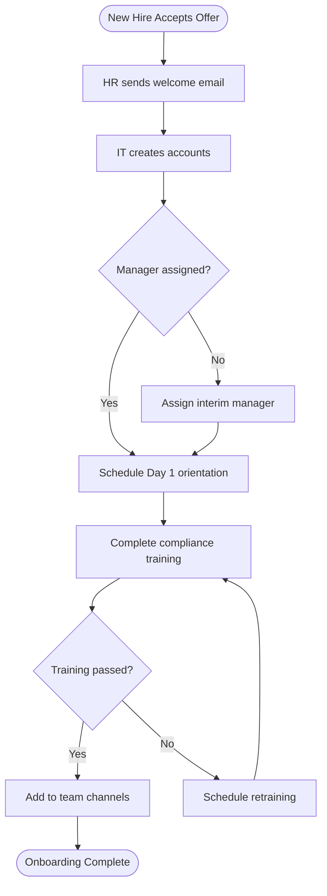
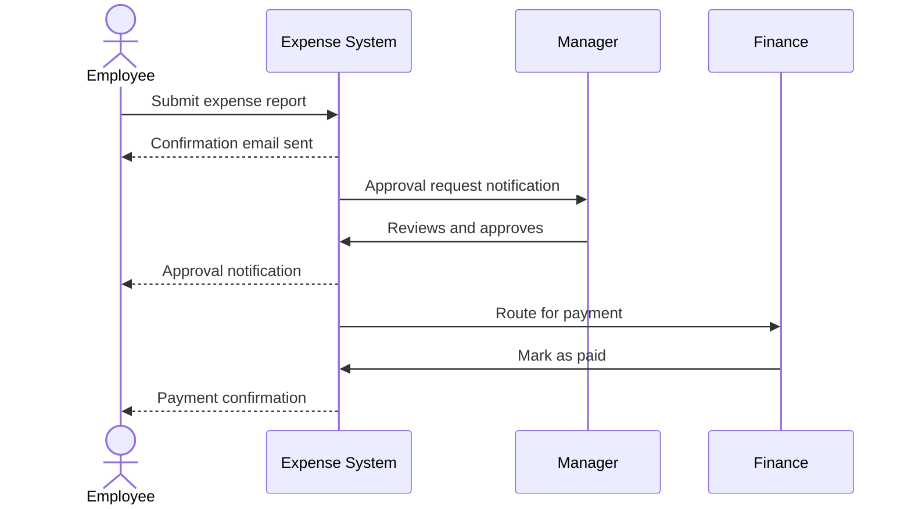
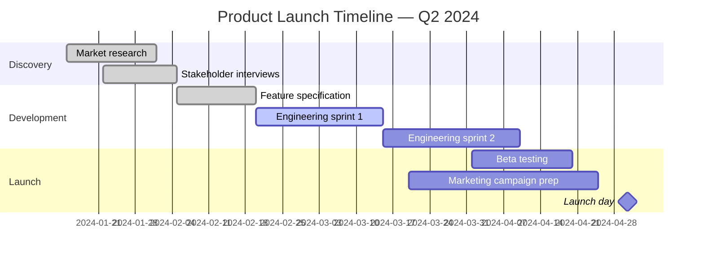

# Mermaid Diagram Examples

GitHub renders Mermaid diagrams directly in Markdown files. Copy these examples as starting points and ask Copilot to modify them for your use case.

---

## Example 1: Flowchart — Employee Onboarding Process

Use this for any process with decisions (yes/no branches).

**Copilot prompt to adapt this:**
> "Modify this Mermaid flowchart to show the [YOUR PROCESS] process. Keep the same structure but replace the steps with: [describe your steps]."

---

## Example 2: Sequence Diagram — Approval Request Flow

Use this for processes involving multiple people or systems communicating in sequence.

**Copilot prompt to adapt this:**
> "Create a Mermaid sequence diagram showing [YOUR PROCESS] with these participants: [list roles/systems]. The sequence of events is: [describe steps in order]."

---

## Example 3: Gantt Chart — Product Launch Timeline

Use this for project timelines with phases and milestones.

**Copilot prompt to adapt this:**
> "Create a Mermaid Gantt chart for the following project timeline: [describe your phases and approximate dates]. Include at least one milestone marker."

---

## Tips for Working with Mermaid and Copilot

- If the diagram doesn't render, ask Copilot: "This Mermaid diagram has a syntax error: [paste code]. Fix it."
- Keep node labels short — under 40 characters works best
- Use `---` (flowchart) for processes, `sequenceDiagram` for interactions, `gantt` for timelines
- Preview Mermaid diagrams at [mermaid.live](https://mermaid.live) before committing
